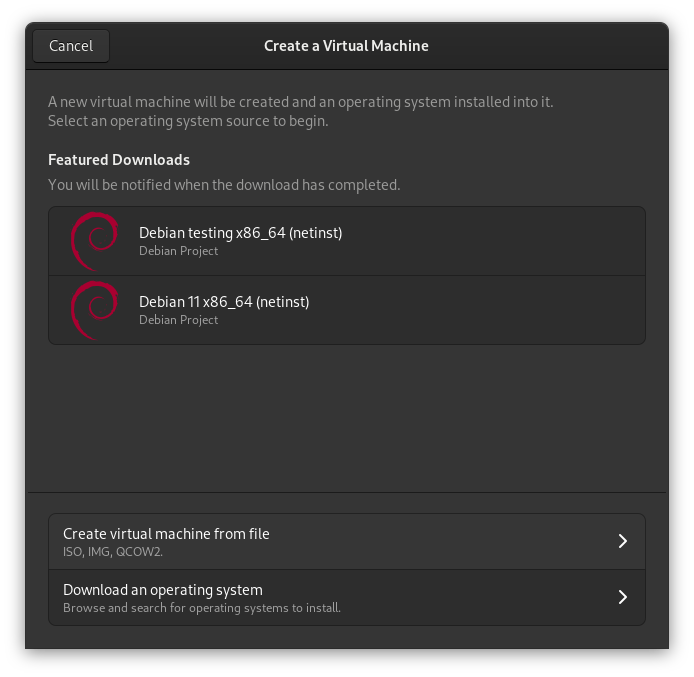
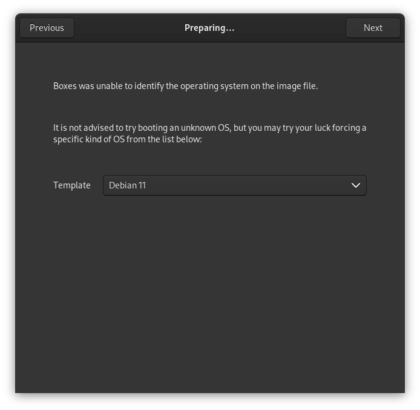
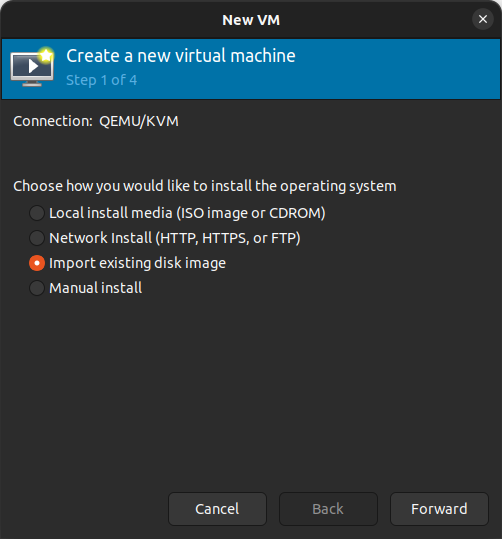
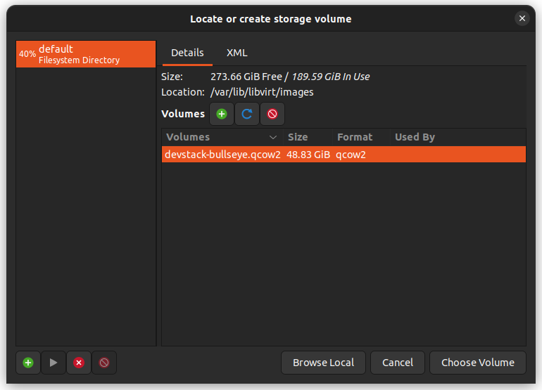
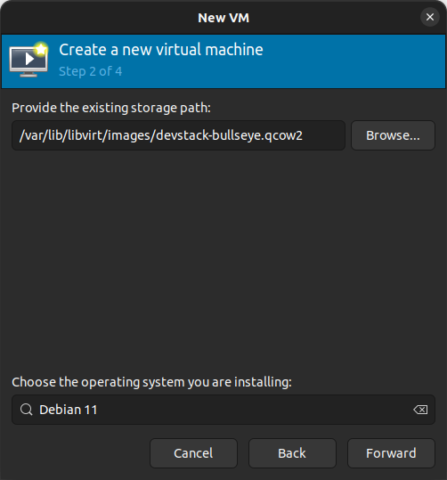
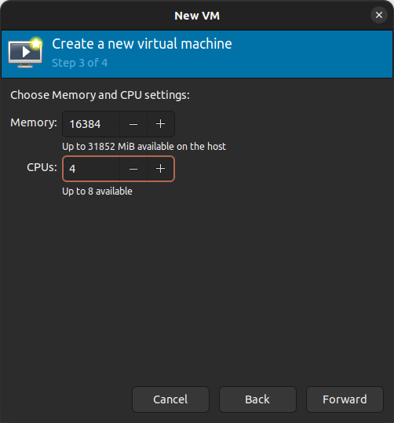
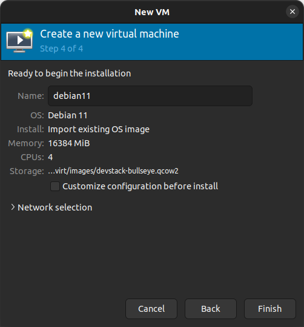
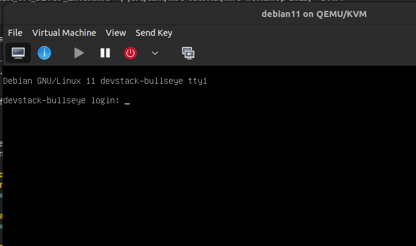

# QEMU (CLI)
Example using 8GB of RAM and 8 CPU cores:
```sh
$ qemu-system-x86_64 -m 8096 -enable-kvm -smp 8 -netdev user,id=mynet.0,hostfwd=tcp::18000-:18000,hostfwd=tcp::18010-:18010 -device virtio-net-pci,netdev=mynet.0 -hda devstack-bullseye.qcow2
```

If this doesn't work for you, consider the following options.

# GNOME Boxes

If you're in a GNOME environment, you can either use [Boxes](https://wiki.gnome.org/Apps/Boxes) or [virt-manager](https://virt-manager.org/).  Both should be installable via your package manager of choice.

## Create the VM in Boxes
### Create a new VM from file


### Select Debian 11 as the OS


### Select 8+ GB of ram, create VM


## Create the VM in virt-manager

Alternatively, you can create the VM in virt-manager.  Open it up, click on new VM, and choose `Import existing disk image`.



Then, browse to the location where you extracted from the zip file, and select it:



Now select "Debian 11" as the OS:



Give the VM 8192 MiB or more of RAM and at least 2 CPU cores.  16384 MiB and 4 cores are recommended, if you have the hardware to spare.



Review settings and click "Finish."



After a short while, a terminal window will pop up showing the operating system boot process.



## Set up port forwarding

There are two ways to do port forwarding.  We'll start with the simplest one, using SSH.

### SSH port forwarding

First, find the IP of your VM:

```bash
$ virsh net-dhcp-leases default
 Expiry Time           MAC address         Protocol   IP address          Hostname            Client ID or DUID
------------------------------------------------------------------------------------------------------------------...
 2023-03-27 18:27:25   52:54:00:91:92:02   ipv4       192.168.122.77/24   devstack-bullseye   ff:00:91:92:02:00:01...
```
In this example, the IP address is `192.168.122.77`.  In your case, it will be different.  SSH into it using the following command, substituting `192.168.122.77` with the IP address you obtained above.  The password is `devstack`.

```
$ ssh -L 18000:localhost:18000 -L 18010:localhost:18010 devstack@192.168.122.77
```

### QEMU port forwarding

One can also use QEMU's [native port forwarding](https://wiki.archlinux.org/title/QEMU#QEMU's_port_forwarding) if SSH is not desirable.

#### Find your VM with `virsh`

`virsh list` or `virsh -c qemu:///session list --all`

find the name of the devstack vm, mine was `debian11`

```bash
$ virsh list
 Id   Name       State
--------------------------
 3    debian11   running

$ virsh -c qemu:///session list --all
 Id   Name            State
--------------------------------
 3    debian11        running
```

#### Edit your VM config using `virsh`

```
$ virsh edit debian11
```

remove the `user` interface block `<interface type='user'>`

add qemu namespace to root tag
```xml
<domain type='kvm'>
```
to
```xml
<domain type='kvm' xmlns:qemu='http://libvirt.org/schemas/domain/qemu/1.0'>
```
add command line stuff to the end
```xml
  <qemu:commandline>
    <qemu:arg value='-netdev'/>
    <qemu:arg value='user,id=mynet.0,net=10.0.10.0/24,hostfwd=tcp::18000-:18000,hostfwd=tcp::18010-:18010'/>
    <qemu:arg value='-device'/>
    <qemu:arg value='virtio-net-pci,netdev=mynet.0,bus=pcie.0,addr=0x3'/>
  </qemu:commandline>
```
